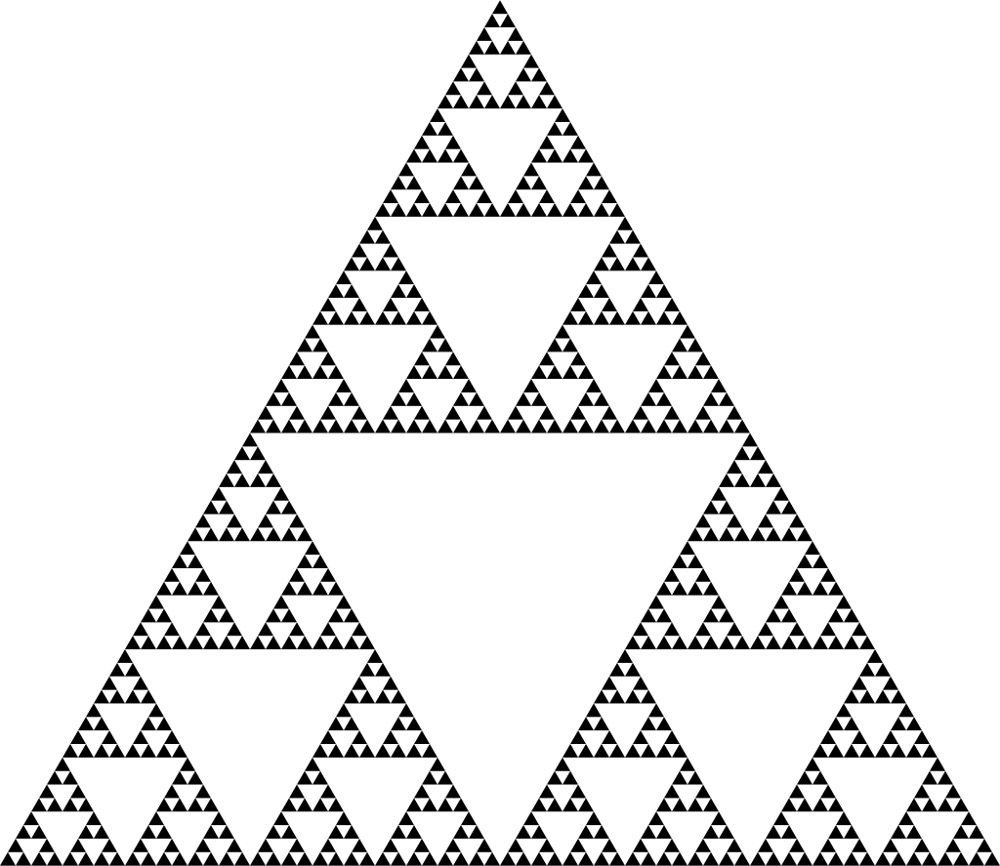

# GDV2 - Sierpinski fractals Project

Ein Projekt von Molham Al-khodari für das Modul GDV2 <br>
a simple Sierpinski fractals implemented with YoshiX, you can finde more infos about YoshiX [hier](docs) <br>

## About the Project

The actual Sierpinski triangle in the strict mathematical sense is that set of points that remains as a "boundary object" after an infinite number of iteration steps. Clearly speaking, the Sierpinski triangle consists of an infinite number of vertices.

 <br>

## import Project

- [ ] you can download the Project as zip date
- [ ] import project with the following command:

```
cd existing_repo
git init
git remote add origin https://git.ai.fh-erfurt.de/mo2467al/gdv1-ping-pong-project.git
git pull origin main
```

## Tolls

- Visual Studio 2019

## Source

- [shadertoy](https://www.shadertoy.com/)

